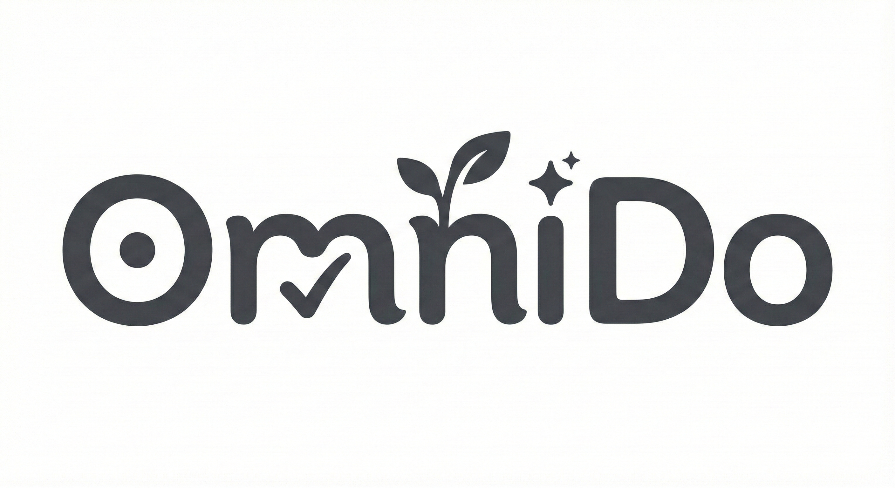

<div align="center">
  <a href="https://github.com/Tuziking/OmniDo">
    
  </a>

  <h1>OmniDo</h1>

  <p>
    <strong>专为 macOS 设计的“Pro”级简约效率工作台。</strong><br>
    融合任务执行、深度专注、习惯重塑与灵感捕获的沉浸式空间。
  </p>

  <p>
    <a href="https://github.com/Tuziking/OmniDo/releases">
      
    </a>
    
    
    
  </p>

  <br>
  
  </div>

---

## 🎨 设计哲学：空气感 & 专业主义

OmniDo 采用 **Apple 风格的单色美学 (Monochrome Aesthetic)**，致力于在功能密度与视觉留白之间找到完美的平衡。

- **高对比系统**：采用 Premium Black (#1c1c1e) 与冷灰配色，确保信息层级清晰、深邃。
- **生机动能**：仅在“完成”与“进度”状态下点缀 iOS 系统级灵动绿，让成就感瞬间迸发。
- **流体动效**：基于 Framer Motion 的物理引擎动画，每一个交互都如丝般顺滑。

---

## ✨ 核心模块展示

### 💡 灵感看板 (Inspiration Moodboard)
**不只是收集，更是视觉化的创意沉浸空间。**
* **智能封面提取**：自动识别 Markdown 文本中的图片并将其转化为瀑布流封面。
* **影院级预览**：采用“毛玻璃背景 + 原始比例”展示，确保每一张灵感图都 100% 完整呈现。
* **自由绘图**：深度集成 Excalidraw 手绘引擎，随时勾勒脑图与草图。

### 🌱 习惯仪式 (Habit Rituals)
**建立可感知的自我提升路径。**
* **可视化热力图**：通过明暗变化的网格，复盘你过去数月的坚持。
* **数据仪表盘**：直观展示今日进度、连续打卡天数与目标达成度。
* **极简打卡**：轻量化的半透明交互按钮，消除操作阻力。

### ✅ 任务执行 (Execution Center)
**剔除干扰，直击核心目标。**
* **时间轴管理**：智能归类“今天”、“即将到来”与“已完成”，让日程一目了然。
* **信息富媒体**：任务标题支持 Markdown 渲染，重要细节不再丢失。
* **快速概览**：顶部统计看板实时反馈任务完成率与逾期压力。

### 🧘 深度专注 (Focus Presence)
**回归纯粹的创作时刻。**
* **极简番茄钟**：动态流光倒计时，专注，从未如此优雅。
* **核心任务置顶**：屏幕中心仅保留当前最重要的目标，物理隔离干扰。
* **自定义配置**：自由设定工作与休息比例，完美适配你的节奏。

---

## 🔧 技术底座

- **Frontend**: React 18 + TypeScript + Vite
- **Shell**: Electron 30
- **Animation**: Framer Motion
- **Icons**: Lucide React
- **Editors**: Excalidraw (Drawing), UIW React MD Editor (Markdown)
- **Styling**: Vanilla CSS (Custom Variable System)

---

## ⚠️ 安装与安全提示

由于本项目未加入 Apple Developer Program，macOS 的 Gatekeeper 安全机制可能会拦截应用的运行。这属于正常现象。

**若提示“无法验证开发者”，请：**
1. 在 `系统设置` -> `隐私与安全性`。
2. 在 `允许以下来源的应用程序` 中选择 `仍要打开` 即可。

---

## 🛠️ 本地开发指南

```bash
# 1. 克隆仓库
git clone https://github.com/Tuziking/OmniDo.git

# 2. 安装依赖
npm install

# 3. 启动开发模式
npm run dev
```

## 📄 许可证

本项目基于 [MIT 许可证](LICENSE) 开源。