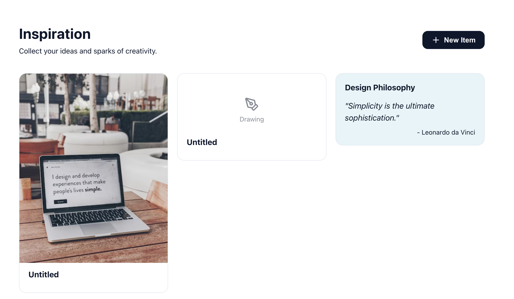
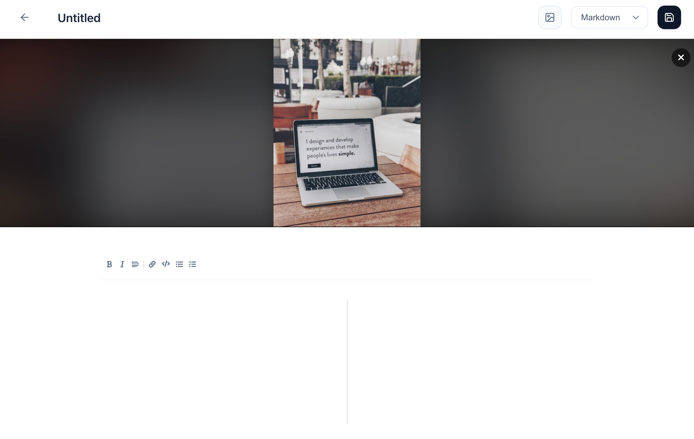
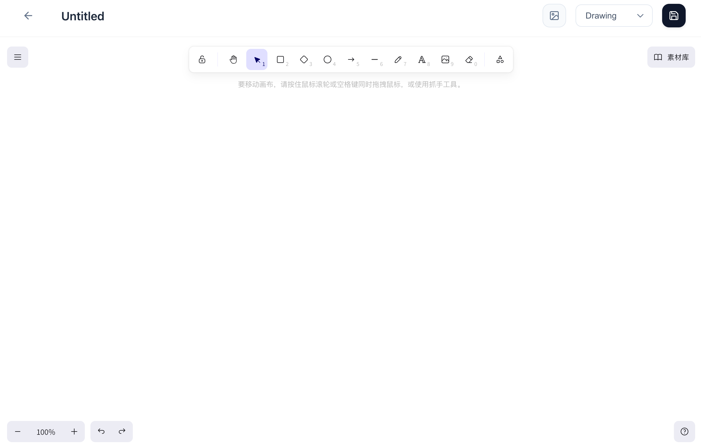
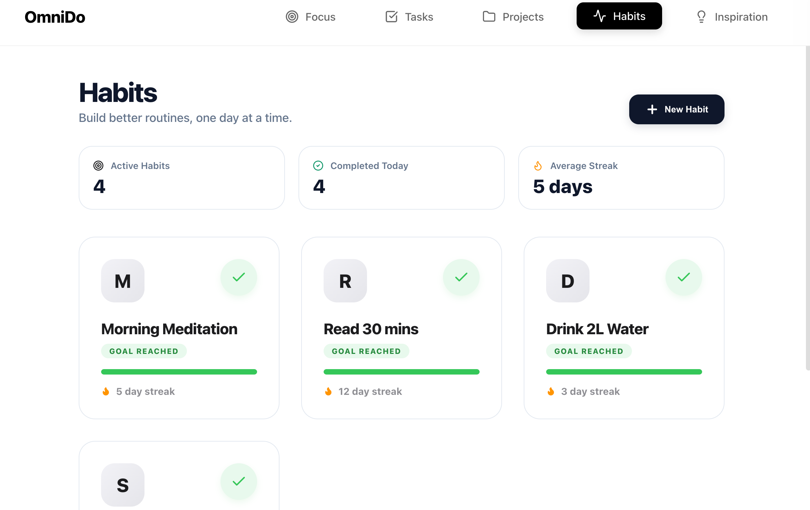
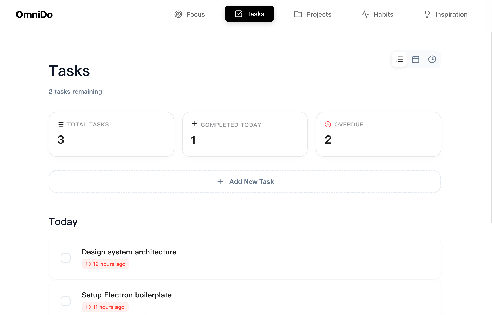
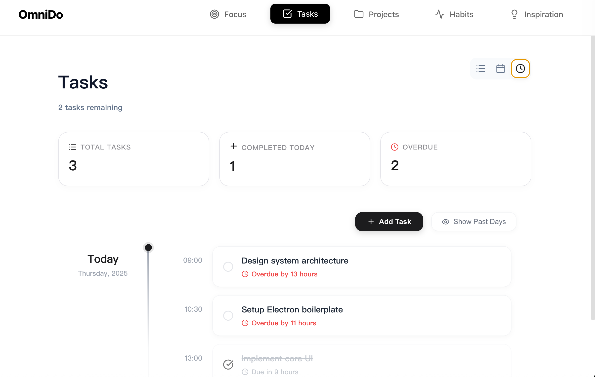
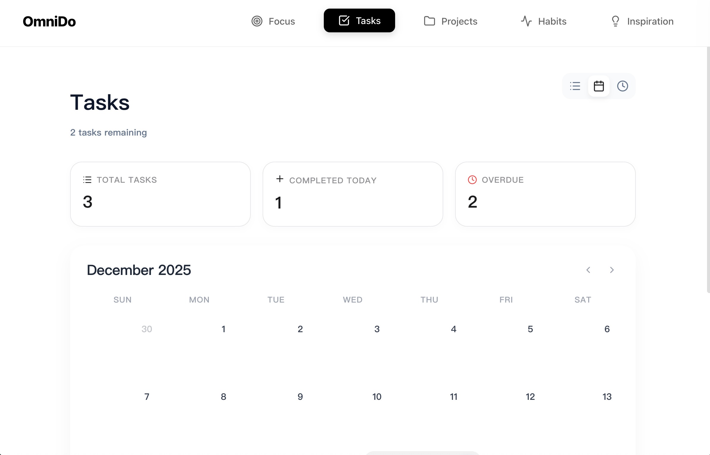
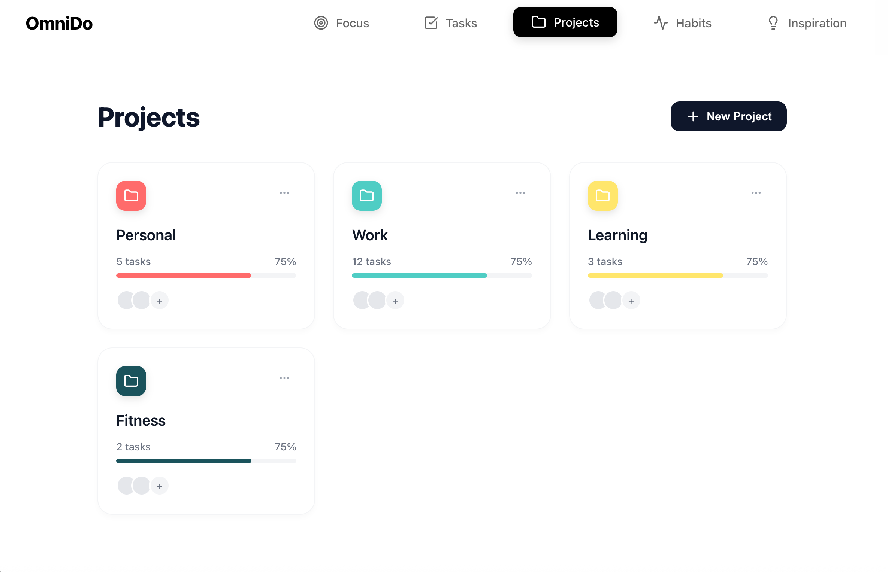
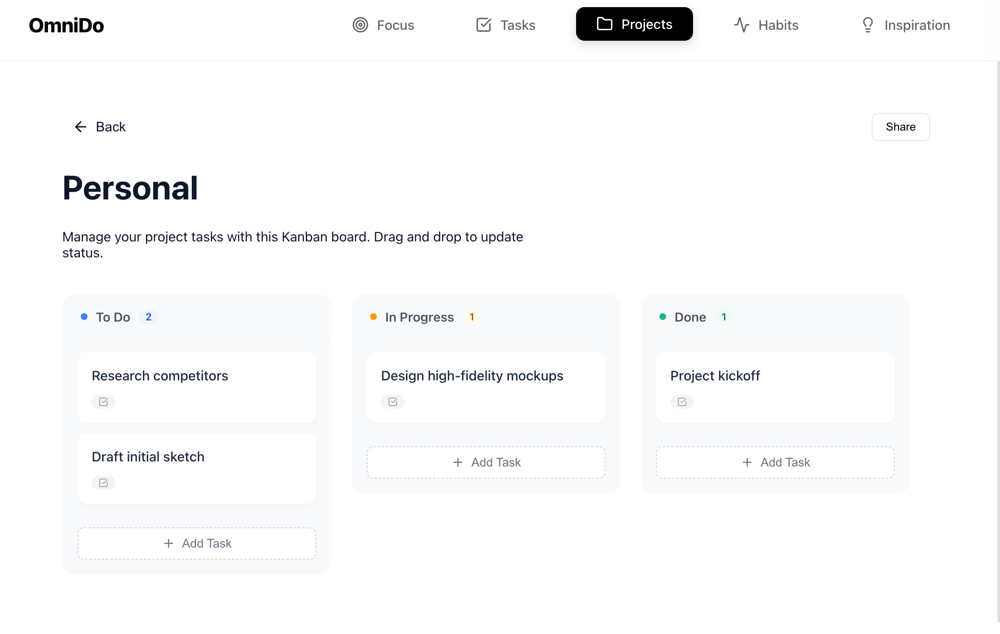

<div align="center">
  <a href="https://github.com/Tuziking/OmniDo">
    
  </a>

  <h1>OmniDo</h1>

  <p>
    <strong>A "Pro" Minimal Productivity Workspace designed for macOS.</strong><br>
    An immersive space blending Task Execution, Deep Focus, Habit Rituals, and Inspiration Capture.
  </p>

  <p>
    <a href="https://github.com/Tuziking/OmniDo/releases">
      
    </a>
    
    
    
  </p>

  <p>
    <b>English</b> | <a href="README.md">简体中文</a>
  </p>

  <br>
  
  </div>

---

## 🎨 Design Philosophy: Air & Professionalism

OmniDo adopts an **Apple-style Monochrome Aesthetic**, striving for a perfect balance between functional density and visual breathing room.

- **High-Contrast System**: Uses Premium Black (#1c1c1e) and cool grey palettes to ensure sharp and deep information hierarchies.
- **Vitality Dynamics**: Strategic use of iOS System Green for "Completion" and "Progress" states to trigger instant gratification.
- **Fluid Animation**: Physics-based animations powered by Framer Motion, making every interaction feel tactile and physical.

---

## ✨ Feature Showcases

### 💡 Inspiration Moodboard
**More than just collection—a visualized immersive space for creativity.**

<table>
  <tr>
    <td width="60%"></td>
    <td width="40%">
      <br>
      
    </td>
  </tr>
</table>

* **Smart Cover Extraction**: Automatically recognizes images within Markdown text and transforms them into waterfall covers.
* **Cinematic Preview**: Displays images with "Blurred background + Contain" logic, ensuring every inspiration is 100% visible.
* **Free Drawing**: Deeply integrated Excalidraw engine for sketching mind maps and drafts anytime.

### 🌱 Habit Rituals
**Establish a tangible path for self-improvement.**



* **Visual Heatmap**: Review your consistency over the past months through dynamic, shading-based grids.
* **Data Dashboard**: Intuitively shows today's progress, current streaks, and goal achievement rates.
* **Minimalist Check-in**: Lightweight, semi-transparent interaction buttons to eliminate friction.

### ✅ Execution Center
**Eliminate distractions, strike the core objectives.**

<table>
  <tr>
    <td width="50%"></td>
    <td width="50%">
      <br>
      
    </td>
  </tr>
</table>

* **Timeline Management**: Intelligently categorizes "Today", "Upcoming", and "Completed" tasks for a clear schedule.
* **Rich Media Context**: Support for Markdown rendering in task titles, ensuring critical details are never lost.
* **Fast Overview**: Real-time feedback on task completion rates and overdue pressure.

### 📂 Project Tracking
**Structured management for complex affairs.**

<table>
  <tr>
    <td width="50%"></td>
    <td width="50%"></td>
  </tr>
</table>

* **Kanban Management**: Intuitive drag-and-drop Kanban experience to control task flow.
* **Multi-level Hierarchy**: Support for infinite-depth sub-task decomposition.

### 🧘 Focus Presence
**Return to the pure moment of creation.**


* **Minimalist Pomodoro**: Dynamic flowing light countdown—focus has never been more elegant.
* **Core Task Pinning**: Only the most important objective remains centered on the screen, physically isolating distractions.
* **Custom Configuration**: Freely set work and rest ratios to perfectly match your rhythm.

---

## 🔧 Technical Stack

- **Frontend**: React 18 + TypeScript + Vite
- **Shell**: Electron 30
- **Animation**: Framer Motion
- **Icons**: Lucide React
- **Editors**: Excalidraw (Drawing), UIW React MD Editor (Markdown)
- **Styling**: Vanilla CSS (Custom Variable System)

---

## ⚠️ Installation & Safety

As this project is not part of the Apple Developer Program, macOS Gatekeeper might block it from running. This is normal.

**If you see "Developer cannot be verified":**
1. Go to `System Settings` -> `Privacy & Security`.
2. Under `Allow apps downloaded from`, select `Open Anyway`.

---

## 🛠️ Local Development

```bash
# 1. Clone the repository
git clone https://github.com/Tuziking/OmniDo.git

# 2. Install dependencies
npm install

# 3. Start development mode
npm run dev
```

## 📄 License

This project is open-sourced under the [MIT License](LICENSE).
